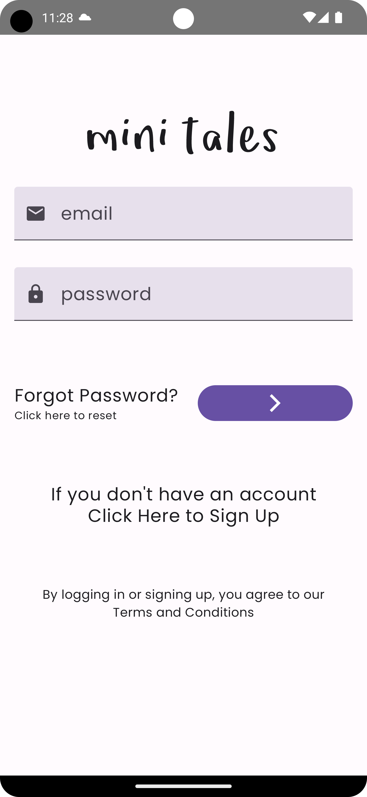
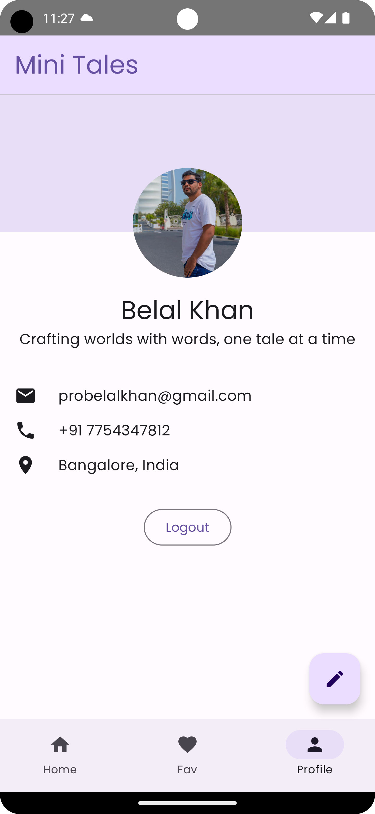
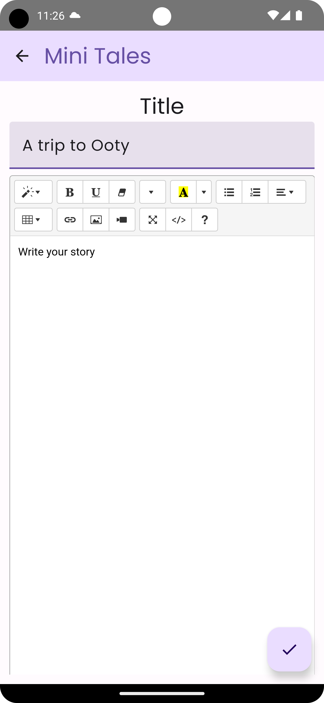

# Mini Tales

Welcome to Mini Tales, a simple and intuitive Android application designed to showcase the power of
multi-modular Android architecture. This app allows users to create personalized profiles and share
captivating short stories, all wrapped in a seamless and delightful user interface built using
Jetpack Compose and 100% Kotlin.

## Watch the tutorial series here

## [Support the Course](https://www.buymeacoffee.com/probelalkhan)

If you've found value in the Android Development in-depth industry-ready course, consider supporting the effort and dedication poured into its creation. Your contribution on [Buy Me a Coffee](https://www.buymeacoffee.com/probelalkhan) will fuel the creation of more content, enable continuous improvement, and help build a community of motivated learners. It's not just about a cup of coffee; it's about fostering a culture of support and collaboration. Together, we can create something exceptional. Your support is not just appreciated; it's a cornerstone for the future of quality education. Thank you for being a part of this incredible journey!

## Tech Stack

<table>
    <tr>
        <td><b>Architecture</b></td>
        <td>Multi Module Architecture, <a href="https://developer.android.com/topic/modularization">check official guide here</a></td>
    </tr>
    <tr>
        <td><b>Language</b></td>
        <td>Kotlin</td>
    </tr>
    <tr>
        <td><b>UI</b></td>
        <td>Jetpack Compose</td>
    </tr>
    <tr>
        <td><b>Dependency Injection</b></td>
        <td>Hilt</td>
    </tr>
</table>

## Screenshots

<table>
    <tbody>
        <tr>
            <td>
                    
            </td>
            <td>
                
            </td>
            <td>
                
            </td>
        </tr>
    </tbody>
</table>

## Authors

- [@probelalkhan](https://www.github.com/probelalkhan)

## Read More 
- [Android Interview Questions Blueprint: Your Ultimate Reference](https://www.simplifiedcoding.net/android-interview-questions/)
- [Kotlin Ktor Android Client – Simplifying Android Networking](https://www.simplifiedcoding.net/kotlin-ktor-android-client/)
- [Android Proto DataStore Mastery with Kotlin](https://www.simplifiedcoding.net/android-proto-datastore-mastery/)

## Badges

